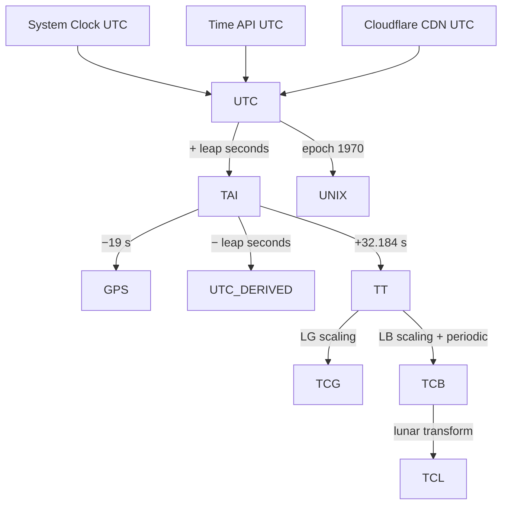

# Epoch Clock — Time Scale Engine

This repository implements a browser-based clock that displays multiple scientific time scales (TAI, UTC, TCG, TCB, GPS, Unix, and experimental TCL) derived from a single canonical timeline.

The clock is intended as an educational visualization of how modern timekeeping systems relate to one another, including relativistic coordinate time scales used in astrodynamics.

The implementation runs entirely in the browser and derives all scales from a continuous estimate of **International Atomic Time (TAI)**.

## Core Design

### Canonical timeline

All time scales are computed from a single internal variable:

`TAI_seconds`

This represents continuous atomic seconds.

The browser system clock is treated as an estimate of UTC and converted to TAI using:

`TAI = Unix_time + leap_seconds + 10`

The `+10 s` offset reflects the difference between TAI and UTC at the Unix epoch (1970-01-01).

Once TAI is established, all other time scales are derived deterministically.

## Time Scale Relationships

```mermaid
flowchart TD

SYS[System Clock<br>performance.now()] --> UNIX[Unix Time<br>seconds since 1970]

UNIX --> UTC[UTC<br>Civil Time]

UTC --> TAI[TAI<br>International Atomic Time]

TAI --> TT[TT<br>Terrestrial Time]

TAI --> GPS[GPS Time]

TAI --> TCL[TCL<br>Lunar Coordinate Time]

TT --> TCG[TCG<br>Geocentric Coordinate Time]

TT --> TDB[TDB<br>Barycentric Dynamical Time]

TDB --> TCB[TCB<br>Barycentric Coordinate Time]
```

TAI is used as the canonical continuous atomic timeline.

Other scales branch from it according to their definitions and offsets.

## Time Scales Implemented

| Scale | Definition                                                                      |
| ----- | ------------------------------------------------------------------------------- |
| TAI   | Continuous atomic time defined by the Bureau International des Poids et Mesures |
| UTC   | Civil time scale derived from TAI with leap seconds                             |
| GPS   | Continuous atomic scale used by the GPS system                                  |
| Unix  | Seconds since 1970 ignoring leap seconds                                        |
| TCG   | Geocentric Coordinate Time                                                      |
| TCB   | Barycentric Coordinate Time                                                     |
| TCL   | Experimental Lunar Coordinate Time                                              |

## Relativistic Coordinate Times

### TCG

Geocentric Coordinate Time is defined by the IAU as the coordinate time scale for the Earth-centered relativistic reference frame.

It differs from Terrestrial Time (TT) by a constant rate offset:

`TCG = TT + LG * (JD − JD₀) * 86400`

where

`LG = 6.969290134 × 10⁻¹⁰`

and

`JD₀ = 2443144.5003725`

which corresponds to:

`1977-01-01 00:00:32.184 TAI`

This epoch is the relativistic synchronization point used by the IAU.

### TCB

Barycentric Coordinate Time is the coordinate time scale for the solar system barycenter.

It runs faster than TT due to gravitational potential and velocity effects relative to the solar system barycenter.

The linearized relationship used here is:

`TCB = TDB + LB * (JD − JD₀) * 86400`

with

`LB = 1.550519768 × 10⁻⁸`

This produces the correct secular drift relative to terrestrial clocks.

## Julian Dates

Julian Date is used for relativistic scale transformations.

`JD = Unix_seconds / 86400 + 2440587.5`

Modified Julian Date is defined as:

`MJD = JD − 2400000.5`

MJD is not itself a time scale. It is only a numbering system that can be used with any scale.

## GPS Time

GPS time is continuous and does not include leap seconds.

The relationship used is:

`GPS = TAI − 19 s`

The display format follows the native representation used by GPS receivers:

`(week, seconds, nanoseconds)`

with epoch:

`1980-01-06`.

## Unix Time

Unix time counts seconds since:

`1970-01-01 00:00:00 UTC`

It ignores leap seconds, meaning that it does not map perfectly to UTC during leap insertions.

This implementation reproduces the standard POSIX behavior.

## Lunar Coordinate Time (TCL)

The TCL scale included here is a placeholder for a lunar coordinate time system.

No globally adopted standard currently exists.

The implementation therefore uses an approximate relativistic scaling relative to TAI to illustrate the concept.

The intent is to support future lunar timekeeping frameworks currently being discussed within the cislunar navigation community.

## System Clock

The "system" time relies on the clock of the client device.

System clock error may therefore be:

* milliseconds on well-synchronized systems
* seconds on misconfigured devices

Future versions may incorporate NTP-derived corrections.

## Browser Precision Limits

The clock is limited by the precision of the browser timing API.

Time is derived from:

`performance.timeOrigin + performance.now()`

which provides a monotonic high-resolution timer.

Typical resolution values are:

| Browser | Resolution |
| ------- | ---------- |
| Chrome  | ~5 µs      |
| Firefox | ~1 µs      |
| Safari  | ~10 µs     |

The display precision is automatically limited to the measured resolution so that the clock does not claim more accuracy than the browser can provide.

### All time scales are derived from the best available network time

The clocks shown on this site are derived from the best available network time using real relationships between time scales.

Coordinate time for all bodies in the solar system use TCB as the reference time, and the human time scales (UTC, GPS, UNIX) use TAI as the reference.



### Leap second table

The leap second offset is currently implemented as a fixed constant.

This value must be updated whenever new leap seconds are announced.

### Relativistic simplifications

The TCB and TCG formulas used here implement the linear rate differences defined by the IAU.

They do not include the full relativistic periodic corrections used in high-precision ephemerides.

Those effects are at the microsecond level and are not observable within browser precision.

### JavaScript numeric precision

All calculations use IEEE-754 double precision.

This provides about 15 decimal digits of precision, which is sufficient for sub-microsecond timing over modern epochs.

## References

Primary standards and definitions used in this implementation:

* IAU 2000 Resolutions on Relativity and Time Scales
* IAU 2006 Resolution B3 (TCB / TCG definitions)
* BIPM documentation on International Atomic Time (TAI)
* IERS Conventions (2010)
* GPS Interface Control Document (IS-GPS-200)
* POSIX IEEE Std 1003.1 time definition

Additional background sources:

* Explanatory Supplement to the Astronomical Almanac
* IERS Bulletins on leap seconds

## Purpose

This project is intended to make modern scientific timekeeping visible and understandable.

Most people interact only with UTC, but spacecraft navigation, relativistic astronomy, and future lunar infrastructure rely on multiple time scales that run at slightly different rates.

This clock demonstrates those relationships in real time.

## Build

The **API** is a Cloudflare Worker written in Rust (`worker-build`) in `backend/`. The **marketing site** is static files in `frontend/`, served by a separate Worker + Assets worker (`wrangler.toml` at repo root).

To run the API locally:

```bash
cd backend
npx wrangler dev
```

This serves the Worker at `http://localhost:8787`. When you open the frontend from **localhost** (via a small static server), `frontend/script.js` uses `http://localhost:8787/api/time` automatically.

To test the full site with the local API:

1. Run `npx wrangler dev` in `backend/` (keep it running).
2. Serve `frontend/` over HTTP (e.g. `cd frontend && python -m http.server 8080`).
3. Open `http://localhost:8080` in a browser.

**First time only** — you may need:

```bash
rustup target add wasm32-unknown-unknown
cargo install worker-build
cd backend && npm ci   # uses committed package-lock.json (same as GitHub Actions)
```

Use `npm install` only when you intentionally change backend Node dependencies and need to refresh the lockfile.
